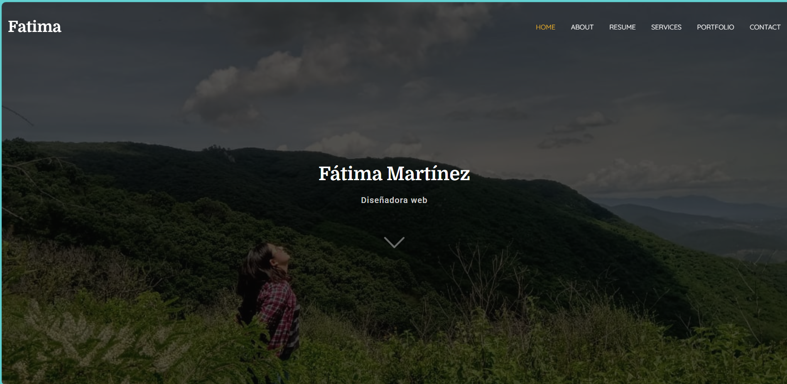
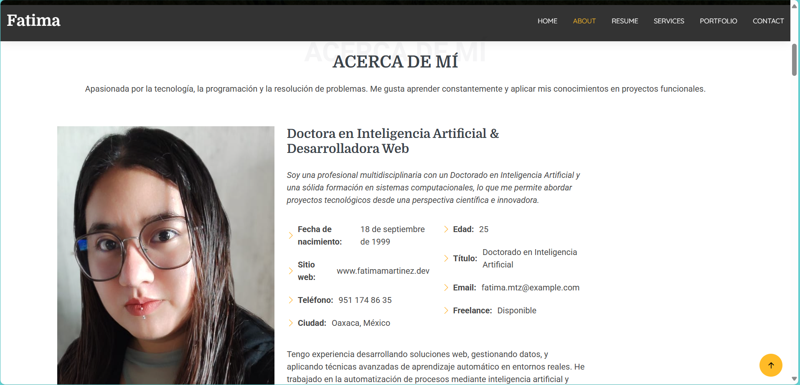
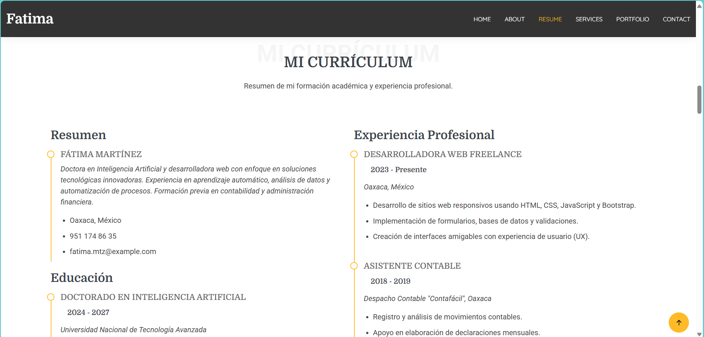
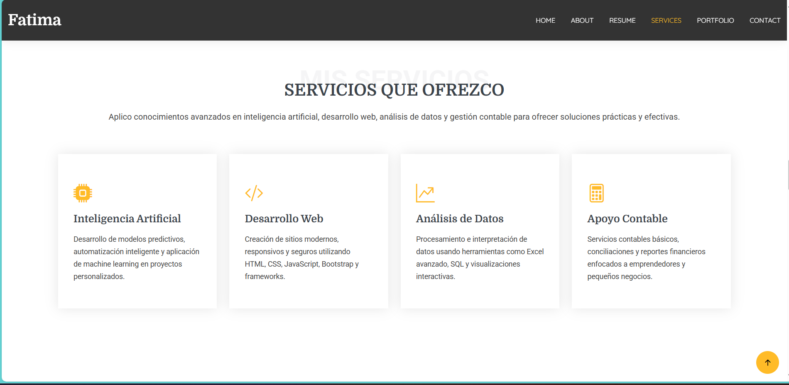
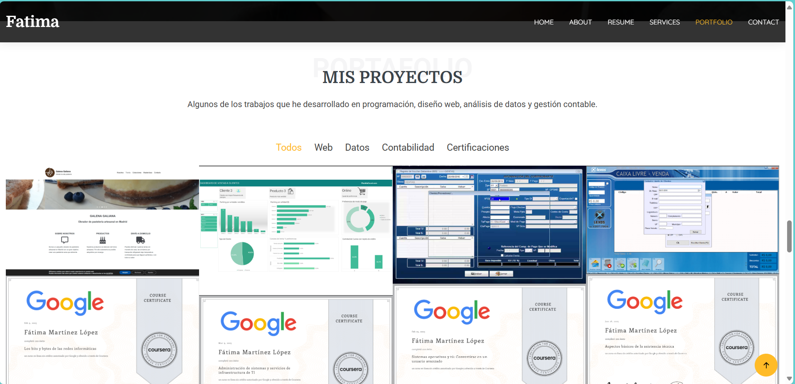
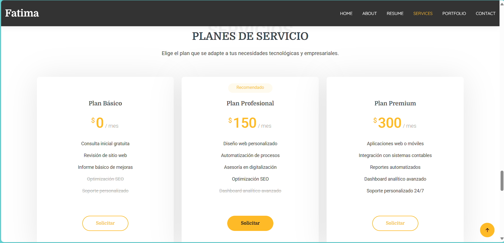

# Portafolio Profesional - Fátima Martínez

## Descripción
Este proyecto es un sitio web personal donde presento mi perfil profesional como Doctora en Inteligencia Artificial, Desarrolladora Web y Técnica en Contabilidad. El sitio está construido con HTML5, CSS3 y Bootstrap 5, con animaciones AOS (Animate on Scroll) y diseño completamente responsivo.

---

##  Descripción del Proyecto

###  Estructura General
El sitio se divide en varias secciones accesibles desde el menú principal de navegación. Está basado en la plantilla [Laura Bootstrap Template](https://bootstrapmade.com/laura-free-creative-bootstrap-theme/), la cual fue modificada para adaptarse a mis necesidades y estilo.

###  Menú Principal
- **Inicio:** Presentación visual rápida del perfil.
- **Sobre mí:** Fotografía, resumen profesional, datos personales y descripción general.
- **Resumen (Currículum):** Formación académica y experiencia profesional.
- **Servicios:** Lista de servicios ofrecidos (IA, desarrollo web, contabilidad, análisis de datos, asesorías).
- **Portafolio:**  Sección que muestra proyectos realizados.
- **Contacto:** Formulario de contacto y datos de comunicación.

---

###  Descripción de cada sección

#### 1. **Inicio**
Banner con imagen de fondo, nombre, título profesional y botón de contacto. Utiliza animaciones de entrada.

#### 2. **Sobre mí**
Sección con dos columnas:
- Foto de perfil.
- Descripción personal, datos clave (edad, ciudad, título, email, etc.) y un resumen profesional.

#### 3. **Resumen (Currículum)**
Sección dividida en dos columnas:
- **Educación:** Listado cronológico de títulos obtenidos (Doctorado, Ingeniería, Técnico).
- **Experiencia Profesional:** Cargos desempeñados con fechas, responsabilidades y lugar.

#### 4. **Servicios**
Tarjetas con íconos que describen los principales servicios que ofrezco:
- Inteligencia Artificial.
- Desarrollo Web.
- Análisis de Datos.
- Apoyo Contable.
- Asesorías & Cursos.

#### 5. **Contacto**
Formulario funcional para enviar mensajes y lista de medios de contacto directo.

---

### 1. Página principal (Inicio)

### 2. Sección "Sobre mí"

### 3. Currículum (Resumen)

### 4. Servicios

### 5. Proyectos

### 6. Precios

##  Tecnologías Utilizadas

- HTML5
- CSS3
- Bootstrap 5
- JavaScript
- AOS (Animate On Scroll)
- Íconos Bootstrap Icons

---

##  Autor

**Fátima Martínez**  

## Demostración en Línea - GitHub Pages

Puedes probar el funcionamiento de la librería directamente aquí:

[Ver demostración en línea](https://fatimamartinezlpz.github.io/portafoliio/)

